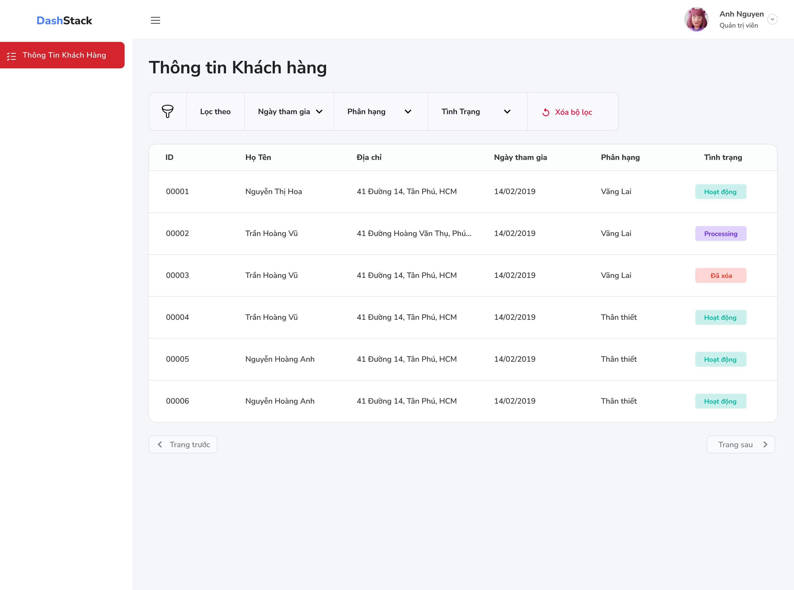
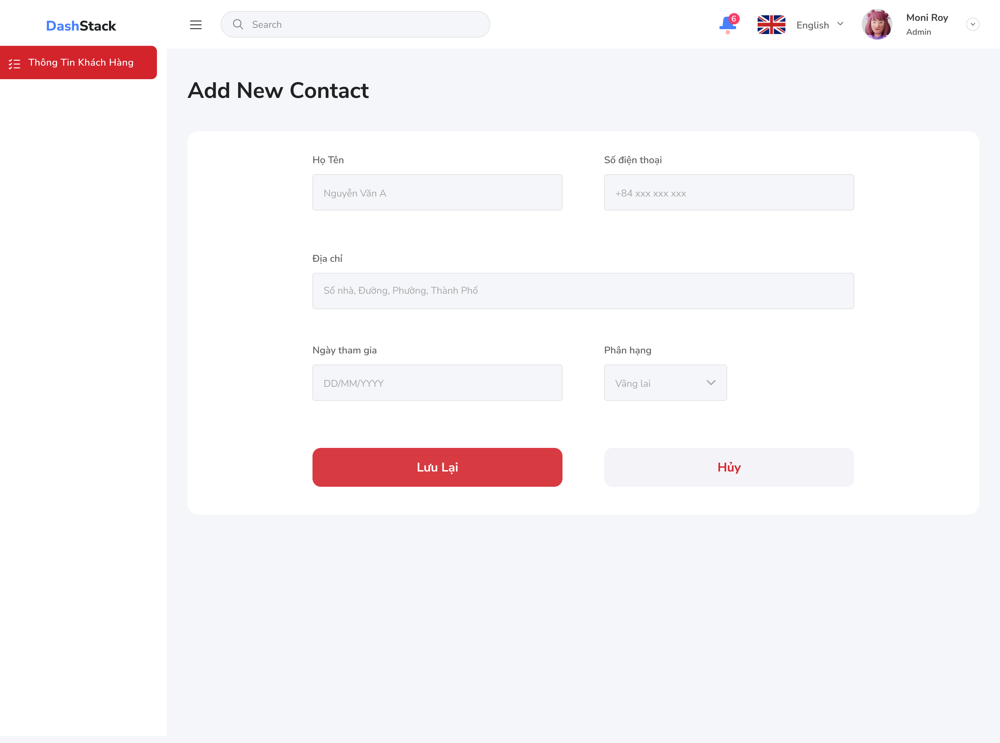

# Customer Management Feature Requirements

## 1. Overview

### 1.1 Purpose
Provide functions to manage (Create/Add/Update) customer information.

### 1.3 Related Permission
- Can List Customer
- Can Read Customer
- Can Create Customer
- Can Update Customer

## 2. User Stories

### US-CM-001: View Customer List
**As a** user  
**I want to** view a list of all customers  
**So that** I can access customer information quickly

**Acceptance Criteria:**
- Customers are displayed in a paginated table (6 customers per page)
- Basic information (prefer to provided UI) is visible
- Customer List can be filtered
- If no Customers are available, show Empty message

### US-CM-002: Create Customer
**As a** sales representative  
**I want to** create a new customer record  
**So that** I can track customer information and interactions

**Acceptance Criteria:**
- Required fields are validated before submission
- Duplicate customer detection (by phone)
- Success/error messages are displayed
- Customer is assigned a unique ID upon creation

### US-CM-003: Update Customer
**As a** user  
**I want to** update customer information  
**So that** I can keep customer records current

**Acceptance Criteria:**
- All editable fields can be modified
- Changes are validated before saving
- Audit trail captures who made changes and when
- Success/error messages are displayed

### US-CM-004: Delete Customer
**As an** administrator  
**I want to** delete a customer record  
**So that** I can remove obsolete or duplicate entries

**Acceptance Criteria:**
- Confirmation dialog is shown before deletion
- Soft delete is implemented (data is archived, not permanently removed)
- Success message is displayed upon deletion

### US-CM-005: Search Customers
**As a** user  
**I want to** search for customers  
**So that** I can quickly find specific customer records

**Acceptance Criteria:**
- Search works across all predefined fields as defined in UI
- Search results update in real-time
- No results message is displayed when applicable
- Search can be cleared to show all customers

## 3. UI/UX Requirements

### 3.1 Customer List Page

### 3.2 Customer Form (Create/Edit)

